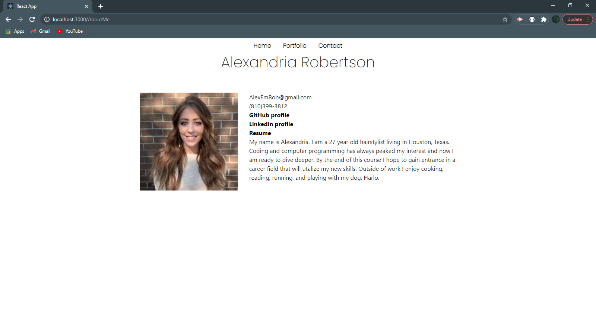

# ReactPortfolio
## Usage
Visit my portfolio<a href="https://alexemrob.github.io/Responsive-Portfolio/">Visit my portfolio </a> to:
<ul><li>Learn about me</li>
  <li>Access my resume</li>
  <li>View my Linked In & Github profiles</li>
  <li>Check out projects I have coded</li>
  <li>Contact me</li></ul>

 

## Questions

 [Visit my repository!](https://www.github.com/alexemrob)
 
For any further questions email me at AlexEmRob@gmail.com
